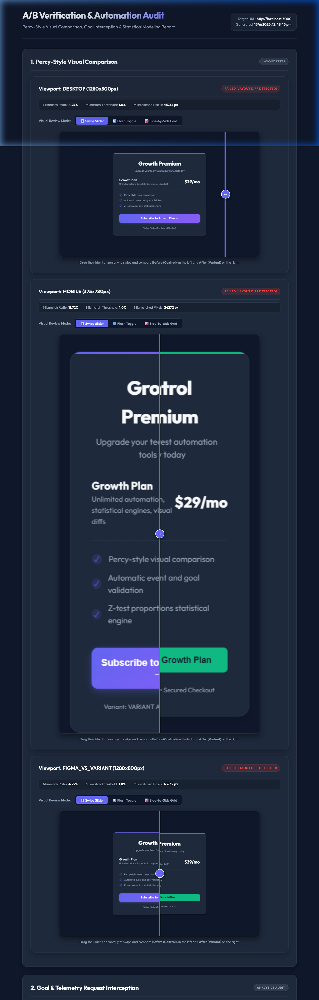
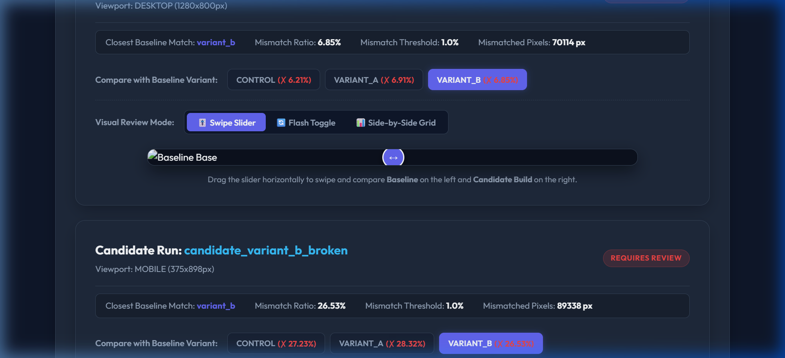
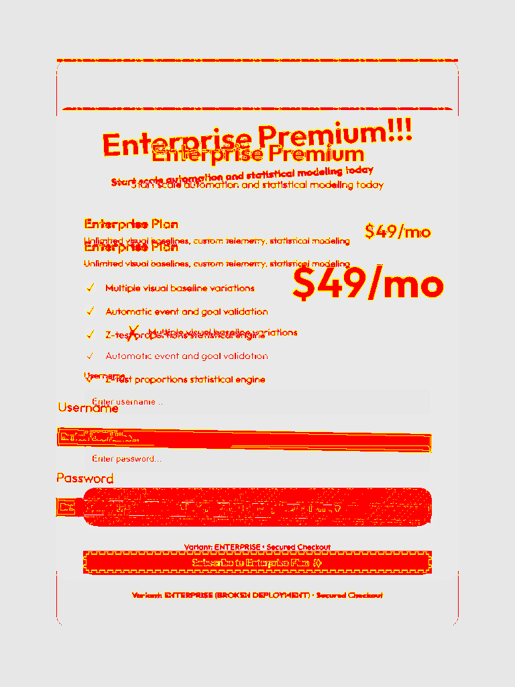

# A/B Test Verification & Visual Regression Audit Suite

An offline-first, private developer-centric verification suite for A/B testing and layout validation. This runner automates **local visual regression diffing**, **Figma design spec matching**, **telemetry analytics event tracing**, and **statistical cohort simulation** in a single unified pipeline. 

Powered locally and natively by **Playwright**, **Pixelmatch**, and **Express**.

---

## Key Features

1.  **True Local Cross-Browser visual regression**: Pre-captures control baseline variations and matches candidato runs across **Chromium (Chrome)**, **Firefox**, and **WebKit (Safari)** for multiple viewports (Desktop, Tablet, Mobile).
2.  **Figma-to-Code validation**: Integrates with the official Figma REST API to download design mockups directly and compare them against coded candidate pages to detect visual implementation drift.
3.  **Analytics Telemetry Tracing**: Simulates page navigations, inputs, and button clicks, passively intercepting JSON telemetry payloads (like `/api/telemetry`) to verify conversion tracking and event fires.
4.  **Statistical Cohort Simulation**: Runs statistical proportion Z-tests based on simulated conversion rate metrics to compute confidence intervals, lifts, p-values, and automatically classify variants as winners or losers.
5.  **Interactive HTML & PDF Reports**: Compiles a premium dark-themed HTML report dashboard with built-in swipe sliders, flash-toggle side-by-sides, and a print-optimized static A4 PDF copy.

---

## 📸 Visual Report & Layout Comparison

Here is the visual output generated by the suite, demonstrating layout regressions and dashboard metrics:

### 1. Interactive Review Dashboard


### 2. Side-by-Side Visual Regression Audit (Failing Variant B compared against Control)


### 3. Responsive Layout Shift Diff File (Tablet view showing layout anomalies)


---

## 🛠️ Prerequisites

-   [Node.js](https://nodejs.org/) (Version 18 or higher recommended)
-   Active internet connection (for initial dependencies and Playwright browser downloads)

---

## 🚀 Getting Started

### 1. Clone the Repository
```bash
git clone https://github.com/Rahul23121995/ab-visual-testing.git
cd ab-visual-testing
```

### 2. Install Dependencies
Install the node packages and fetch Playwright's local browser binaries:
```bash
npm install
npx playwright install
```

### 3. Start the Target Application (Mock Demo Server)
Run the application server in the background (or target your own active application port):
```bash
npm start
```
*The mock application server will launch at `http://localhost:3000` representing an enterprise site layout with variant routing.*

### 4. Run the Verification Audit Suite
In a new terminal window, execute the verifier runner:
```bash
npm run verify
```

Once the test run completes, you will find generated visual screenshots and comparative audit reports inside your project root:
*   **Interactive Review Dashboard**: `reports/ab-experiment-report.html`
*   **Static Print Copy**: `reports/ab-experiment-report.pdf`
*   **Visual Screenshot Captures**: `reports/visual/`

---

## ⚙️ Configuration (`ab-config.json`)

Configure the test viewports, baseline variants, target candidate pages, telemetry tracking goals, and cohort statistics inside `ab-config.json` in the root directory:

```json
{
  "targetUrl": "http://localhost:3000",
  "figma": {
    "fileKey": "YOUR_FIGMA_FILE_KEY",
    "nodeId": "YOUR_DESIGN_FRAME_NODE_ID",
    "token": "YOUR_PERSONAL_ACCESS_TOKEN"
  },
  "visual": {
    "browsers": ["chromium", "firefox", "webkit"],
    "viewports": [
      { "width": 1280, "height": 800, "name": "desktop" },
      { "width": 768, "height": 1024, "name": "tablet" },
      { "width": 375, "height": 667, "name": "mobile" }
    ],
    "mismatchThreshold": 0.05
  },
  "tracing": {
    "simulationSteps": [
      {
        "name": "Landing Page View",
        "action": "navigate",
        "expectedTelemetry": {
          "urlPattern": "/api/telemetry",
          "payload": { "type": "pageview" }
        }
      },
      {
        "name": "Click Primary CTA",
        "action": "click",
        "selector": ".cta-button",
        "expectedTelemetry": {
          "urlPattern": "/api/telemetry",
          "payload": { "type": "conversion", "goal": "cta_click" }
        }
      }
    ]
  },
  "simulation": {
    "sampleSize": 2500,
    "scenarios": [
      {
        "name": "Variant A - Successful Improvement",
        "controlTrueRate": 0.12,
        "variantTrueRate": 0.156
      }
    ]
  }
}
```

---

## 📂 Project Structure

```
├── ab-config.json          # Verifier configuration settings
├── ab-verify.js            # Main execution pipeline orchestrator
├── demo-server.js          # Express app routing variant layouts & telemetry endpoints
├── demo-app/               # HTML template directories for Control & Variant variants
│   └── public/             # Coded styles and page files under test
├── src/                    # Source core verifier modules
│   ├── figma.js            # Figma API layout spec syncing module
│   ├── visual.js           # Playwright screenshot capture & pixelmatch comparison engine
│   ├── tracer.js           # User telemetry tracking event interception module
│   ├── reporter.js         # Premium HTML/PDF output generation scripts
│   └── utils/
│       └── stats.js        # A/B conversion lifts & Proportion Z-test helpers
└── reports/                # Visual diffs, screenshots, and compiled reports
```
